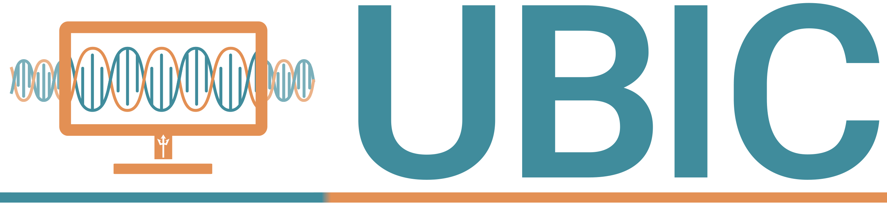

|
|
|

Welcome to the Bioinformatics Crash Course!
===========================================

.. toctree::
   :maxdepth: 1
   :caption: Lessons
   
   1_Welcome.md
   2_LinuxTerminal.md
   3_AdvancedTerminal.md
   4_Python.md
   5_Biopython.md
   6.1_Challenge1.md
   6.2_BiopythonV2.md
   7_DataAnalysisWithPython.md
   8_Classification_PCA.md
   9.1_Clustering.md
   9.2_Dirichlet_Challenge.md
   10.1_Alignment.md
   10_2_Codon_Alignment.md
   11.1_Phylogenetics.md
   11.2_Challenge2.md
   
   :caption: Lessons
   6.1_Challenge1.md
   9.2_Dirichlet_Challenge.md
   11.2_Challenge2.md
   about.md
   
